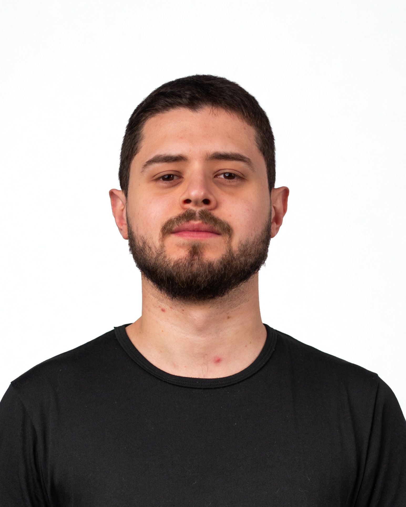

  <h1>🎸 RockBand</h1>
  <h3>Sistema em Java Orientado a Objetos voltado para o ensino prático de Métodos e Funções.</h3>
  
Este projeto foi desenvolvido pela nossa equipe na Trilha de Java do programa Geração Caldeira 2026. Nosso objetivo principal foi criar uma ferramenta interativa para explicar, de forma clara e acessível, o funcionamento de métodos e funções para a nossa turma.

  
Além de servir como material de apoio para a apresentação, este repositório documenta a nossa capacidade de trabalhar colaborativamente, modelar arquiteturas limpas e aplicar os pilares da Programação Orientada a Objetos (POO).

  
  
  

 

## 📋 Sobre o Projeto

O **RockBand** é uma aplicação interativa via linha de comando (CLI) construída em Java, no ambiente de desenvolvimento Intellij IDEA onde o usuário pode gerenciar a formação de uma banda e orquestrar um show. 

O desenvolvimento deste sistema nasceu para atender a uma **proposta de atividade da Trilha de Java do Geração Caldeira**, que trazia o desafio de explicar o funcionamento de métodos e funções para a turma. Para cumprir esse requisito fugindo dos exemplos tradicionais e tornando o aprendizado mais prazeroso, nosso grupo decidiu aplicar a teoria dentro da temática de uma banda de rock. 

O sistema foi arquitetado com foco na separação de responsabilidades, garantindo que o código não ficasse rígido. Um dos destaques da nossa entrega é a capacidade da aplicação de comparar o histórico dos integrantes e identificar automaticamente se o show atual é da formação original da banda ou se trata de uma colaboração histórica entre músicos de projetos distintos.
---

## 🏛️ Arquitetura e POO

Para garantir que o código fosse não apenas funcional, mas também um material de estudo para a turma, aplicamos os pilares da Orientação a Objetos nas decisões da arquitetura do nosso sistema como:

*   **Herança:** A classe `Musico` herda da classe base `Pessoa`. Afinal, todo músico é, antes de tudo, uma pessoa. Isso nos permitiu demonstrar uma das vantagens da utilização de heranças, o reaproveitamento de características, neste caso com o atributo nome.
*   **Interfaces e Padrão Comportamental:** Optamos por não limitar o sistema com heranças diretas para as funções dos músicos dentro da banda. Através da interface `Funcao`, isolamos este comportamento. Exemplo: Um integrante não *é* um guitarrista, é um músico que *tem* a habilidade de tocar guitarra. Isso não só permite flexibilidade para manutenções, como também que um músico cumpra diferentes funções no futuro, caso necessário.
*   **Polimorfismo:** Durante o fluxo de cadastro, uma mesma variável consegue assumir formas diferentes (`Vocalista`, `Guitarrista`, `Baixista` ou `Baterista`), respondendo dinamicamente à interação do usuário.
*   **Sobrescrita e Sobrecarga de Métodos:** A sobrescrita garante que cada instrumento execute sua função de maneira única. Já a sobrecarga foi aplicada na classe `Banda`, permitindo que a apresentação ocorra de duas formas: recebendo o nome de uma música específica (show ensaiado) ou executando o método vazio (uma Jam ou improviso entre os músicos).

---

## ⚙️ Funcionalidades

*   **Cadastro Interativo:** Menus intuitivos no terminal para a criação da banda principal e inserção de membros passo a passo.
*   **Validação de Dados:** Implementação de loops de segurança que limitam o comportamento do usuário e impedem a quebra do sistema diante de entradas inválidas.
*   **Lógica de Formação:** Verificação autônoma de divergências entre a banda anfitriã do show e as bandas de origem de cada músico cadastrado.
*   **Múltiplos Formatos de Show:** Liberdade para o usuário orquestrar o evento, possibilitando a execução do código com métodos distintos nos bastidores.

---

## 🚀 Como executar o projeto

Para testar o nosso código na sua máquina ou utilizá-lo como base de estudos, siga os passos abaixo:

1. Clone este repositório no seu terminal:
2. Abra a pasta do projeto na sua IDE de preferência.
3. Localize o arquivo Main.java dentro da pasta src.
4. Execute a classe Main e siga as instruções exibidas no console para montar o seu show.

👥 Desenvolvedores

<table align="center">
  <tr valign="top">
    <td align="center">
        
      <b>Gabriel Boanova</b>  
      
      
    </td>
    <td align="center">
        
      <b>Gabriela Martins</b>  
      
      
    </td>
    <td align="center">
        
      <b>Humberto Barreto</b>  
      
      
    </td>
    <td align="center">
        
      <b>Lucas Villante</b>  
      
      
    </td>
    <td align="center">
        
      <b>Paulino Guimarães</b>  
      
      
    </td>
  </tr>
</table>
